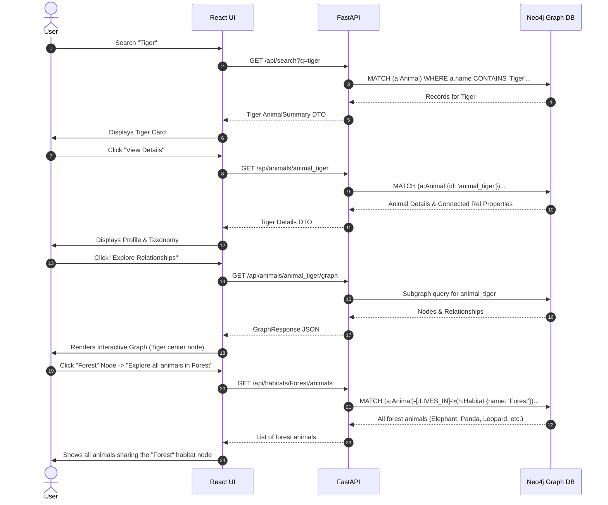

# High-Level Design (HLD) — Animal Kingdom Knowledge Graph

## 1. System Overview

The **Animal Kingdom Knowledge Graph** is an academic graph-based web application designed to model complex ecological and biological relationships among animals, taxonomy, habitats, diets, and conservation statuses using **Neo4j** and **Cypher**.

Unlike relational database systems that normalize entities into tabular schemas joined by foreign keys, this knowledge graph treats **entities and their direct relationships as first-class citizens**:

$$\text{ENTITY} \xrightarrow{\text{RELATIONSHIP}} \text{ENTITY}$$

---

## 2. Architecture Diagram

```mermaid
flowchart TD
    subgraph Client["Presentation Layer (Client)"]
        User["User / Academic Judge"]
        ReactUI["React 19 + Tailwind CSS Frontend"]
        GraphViz["SVG Graph Visualizer (Pan / Zoom / Select)"]
        NLQBox["Ask Knowledge Graph Interface"]
    end

    subgraph Server["Application Layer (FastAPI)"]
        FastAPI["FastAPI REST API Server"]
        CORS["CORS & Error Middleware"]
        NLParser["Natural Language to Cypher Parser"]
        ServiceLayer["Service Layer (Animal, Search, Graph, Query)"]
    end

    subgraph DataAccess["Data Access Layer"]
        Neo4jDriver["Official Neo4j Python Driver"]
    end

    subgraph Database["Graph Database Layer (Neo4j)"]
        Neo4jEngine["Neo4j Graph Database (Bolt Protocol)"]
        CypherEngine["Cypher Query Execution Engine"]
        Constraints["Uniqueness Constraints & Indexes"]
        GraphStore[("Knowledge Graph Store: Nodes & Edges")]
    end

    User -->|Interacts with| ReactUI
    ReactUI --> GraphViz
    ReactUI --> NLQBox
    ReactUI -->|HTTP / REST API (Port 8000)| FastAPI
    FastAPI --> CORS
    CORS --> NLParser
    CORS --> ServiceLayer
    NLParser -->|Generates Safe Cypher| ServiceLayer
    ServiceLayer -->|Session / Bolt (Port 7687)| Neo4jDriver
    Neo4jDriver --> Neo4jEngine
    Neo4jEngine --> CypherEngine
    CypherEngine --> Constraints
    CypherEngine --> GraphStore
    GraphStore -->|Graph Subgraphs & Records| CypherEngine
    CypherEngine -->|Cypher Records| Neo4jDriver
    Neo4jDriver -->|JSON Models| ServiceLayer
    ServiceLayer -->|Pydantic DTOs| FastAPI
    FastAPI -->|JSON REST Responses| ReactUI
```

---

## 3. Component Breakdown

### 3.1. Frontend (React + Tailwind CSS)
* **Navbar**: Global navigation, academic subtitle, and live database connection pulse indicator.
* **Home Page**: Dynamic metrics aggregated from Neo4j (Animals, Species, Habitats, Diets, Endangered, Continents), quick categorization cards, and sample tiger ecosystem graph viewer.
* **Explore Animals**: Multi-facet filter bar (Class, Habitat, Diet, Status, Continent) with instant name search.
* **Animal Details**: Detailed entity attributes, taxonomy breakdown, prey/food badges, and direct integration with the interactive relationship graph viewer.
* **Ask Knowledge Graph**: Dedicated natural-language querying section with clickable query chips, generated Cypher inspector, and results grid.
* **GraphViewer**: Responsive SVG interactive canvas supporting pan, zoom in/out, reset, labeled relationship arrows, and node inspection.

### 3.2. Backend (FastAPI + Python Driver)
* **Configuration (`config.py`)**: Environment variables loaded via `python-dotenv` and validated via Pydantic.
* **Neo4j Manager (`database/neo4j.py`)**: Singleton connection pool wrapping `GraphDatabase.driver` with health verification and graceful connection failure handling.
* **Schema Management (`database/schema.py`)**: Declarative definitions for uniqueness constraints and search indexes.
* **Service Layer (`services/`)**:
  * `animal_service.py`: Computes graph statistics and detailed animal entities.
  * `search_service.py`: Executes parametric graph queries for habitats, diets, conservation statuses, and continents.
  * `query_service.py`: Parses natural language queries into Cypher statements without external LLM dependencies.
  * `graph_service.py`: Extracts nodes and labeled relationships into visualization-ready graph data structures.

---

## 4. Graph Traversal User Experience (UX Flow)


