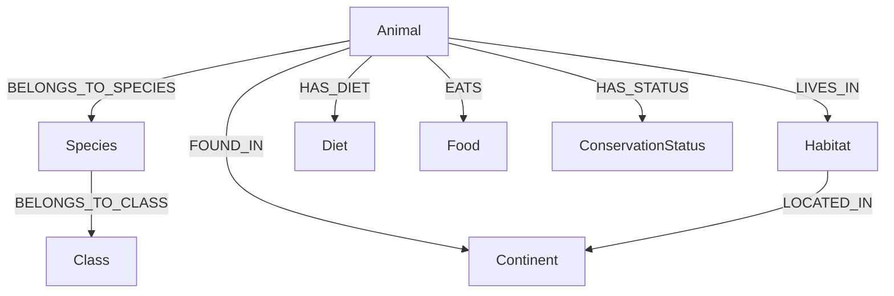

# Knowledge Graph Model — Animal Kingdom

## 1. Graph Ontology Overview

The knowledge graph models biological, ecological, geographical, and conservation dimensions using labeled nodes and directed edges in **Neo4j**.



---

## 2. Node Labels and Properties

### 2.1. `Animal`
* `id` *(String, Primary Key)*: Stable identifier (e.g. `animal_tiger`).
* `name` *(String)*: Common animal name (e.g. `Tiger`).
* `scientificName` *(String)*: Binomial nomenclature (e.g. `Panthera tigris`).
* `description` *(String)*: Concise overview of behavioral traits.
* `averageLifespan` *(Integer)*: Average lifespan in years.
* `imageUrl` *(String)*: High-resolution reference photograph URL.

### 2.2. `Species`
* `id` *(String, Primary Key)*: Stable identifier (e.g. `species_panthera_tigris`).
* `name` *(String)*: Vernacular or sub-species designation.
* `scientificName` *(String)*: Specific binomial name.

### 2.3. `Class`
* `id` *(String, Primary Key)*: Stable identifier (e.g. `class_mammal`).
* `name` *(String)*: Taxonomic class (e.g. `Mammal`, `Bird`, `Reptile`, `Amphibian`, `Fish`, `Insect`).

### 2.4. `Habitat`
* `id` *(String, Primary Key)*: Stable identifier (e.g. `habitat_forest`).
* `name` *(String)*: Biome name (e.g. `Forest`, `Grassland`, `Savanna`, `Desert`, `Ocean`, `River`, `Wetland`, `Mountain`, `Polar Tundra`).
* `description` *(String)*: Ecological description of the biome.

### 2.5. `Diet`
* `id` *(String, Primary Key)*: Stable identifier (e.g. `diet_carnivore`).
* `name` *(String)*: Trophic feeding strategy (e.g. `Carnivore`, `Herbivore`, `Omnivore`, `Insectivore`).

### 2.6. `Food`
* `id` *(String, Primary Key)*: Stable identifier (e.g. `food_deer`).
* `name` *(String)*: Prey or plant nourishment (e.g. `Deer`, `Wild Boar`, `Grass`, `Bamboo`, `Fish`, `Insects`).

### 2.7. `ConservationStatus`
* `id` *(String, Primary Key)*: Stable identifier (e.g. `status_endangered`).
* `name` *(String)*: IUCN Red List Category (e.g. `Least Concern`, `Near Threatened`, `Vulnerable`, `Endangered`, `Critically Endangered`).

### 2.8. `Continent`
* `id` *(String, Primary Key)*: Stable identifier (e.g. `continent_asia`).
* `name` *(String)*: Geographical region (e.g. `Asia`, `Africa`, `Europe`, `North America`, `South America`, `Australia`, `Antarctica`).

---

## 3. Relationships

| Relationship Type | Source Node | Target Node | Semantic Meaning |
|---|---|---|---|
| `BELONGS_TO_SPECIES` | `Animal` | `Species` | Connects an individual animal entity to its biological species |
| `BELONGS_TO_CLASS` | `Species` | `Class` | Connects biological species to higher-level taxonomic class |
| `LIVES_IN` | `Animal` | `Habitat` | Specifies ecosystem biomes where the animal lives |
| `HAS_DIET` | `Animal` | `Diet` | Categorizes trophic feeding classification |
| `EATS` | `Animal` | `Food` | Direct predator-prey or herbivorous forage interactions |
| `HAS_STATUS` | `Animal` | `ConservationStatus` | Official IUCN threat level |
| `FOUND_IN` | `Animal` | `Continent` | Global continental distribution |
| `LOCATED_IN` | `Habitat` | `Continent` | Continental location of ecosystems |

---

## 4. Uniqueness Constraints & Indexes

```cypher
// Uniqueness Constraints
CREATE CONSTRAINT animal_id_unique IF NOT EXISTS FOR (a:Animal) REQUIRE a.id IS UNIQUE;
CREATE CONSTRAINT species_id_unique IF NOT EXISTS FOR (s:Species) REQUIRE s.id IS UNIQUE;
CREATE CONSTRAINT class_id_unique IF NOT EXISTS FOR (c:Class) REQUIRE c.id IS UNIQUE;
CREATE CONSTRAINT habitat_id_unique IF NOT EXISTS FOR (h:Habitat) REQUIRE h.id IS UNIQUE;
CREATE CONSTRAINT diet_id_unique IF NOT EXISTS FOR (d:Diet) REQUIRE d.id IS UNIQUE;
CREATE CONSTRAINT food_id_unique IF NOT EXISTS FOR (f:Food) REQUIRE f.id IS UNIQUE;
CREATE CONSTRAINT status_id_unique IF NOT EXISTS FOR (cs:ConservationStatus) REQUIRE cs.id IS UNIQUE;
CREATE CONSTRAINT continent_id_unique IF NOT EXISTS FOR (ct:Continent) REQUIRE ct.id IS UNIQUE;

// Search Indexes
CREATE INDEX animal_name_idx IF NOT EXISTS FOR (a:Animal) ON (a.name);
CREATE INDEX animal_sci_name_idx IF NOT EXISTS FOR (a:Animal) ON (a.scientificName);
CREATE INDEX habitat_name_idx IF NOT EXISTS FOR (h:Habitat) ON (h.name);
CREATE INDEX diet_name_idx IF NOT EXISTS FOR (d:Diet) ON (d.name);
CREATE INDEX status_name_idx IF NOT EXISTS FOR (cs:ConservationStatus) ON (cs.name);
CREATE INDEX continent_name_idx IF NOT EXISTS FOR (ct:Continent) ON (ct.name);
```
